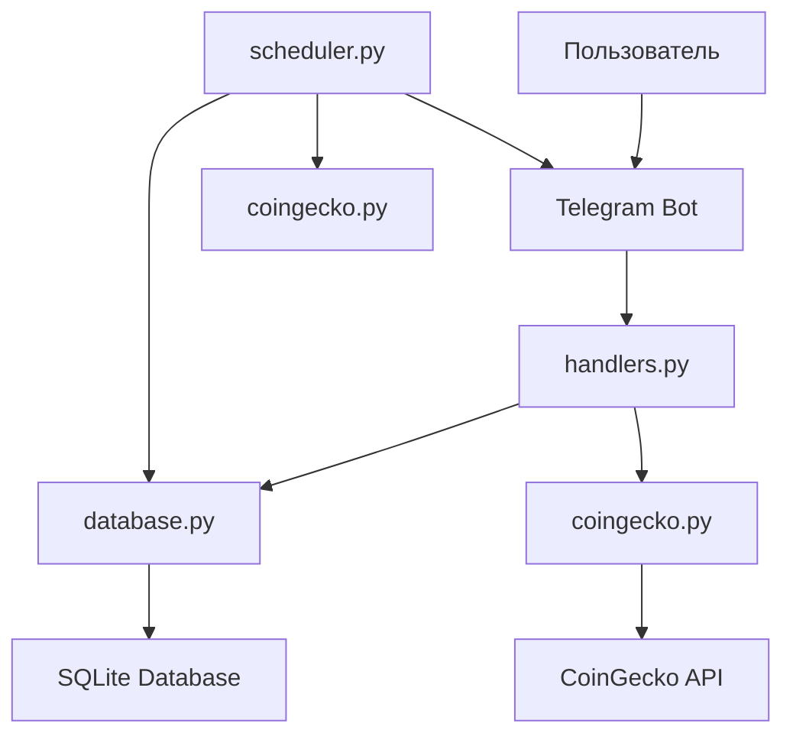

# API Документация CryptoWatcher

## Обзор

CryptoWatcher использует несколько API для своей работы:

1. **CoinGecko API** - для получения данных о криптовалютах
2. **Telegram Bot API** - для взаимодействия с пользователями
3. **Внутренний API** - для работы с базой данных

## CoinGecko API

### Эндпоинты

#### Получение текущих цен
```
GET https://api.coingecko.com/api/v3/simple/price
```

**Параметры:**
- `ids` (string) - список идентификаторов криптовалют через запятую
- `vs_currencies` (string) - валюта для сравнения (usd)

**Пример запроса:**
```
GET https://api.coingecko.com/api/v3/simple/price?ids=bitcoin,ethereum&vs_currencies=usd
```

**Пример ответа:**
```json
{
  "bitcoin": {
    "usd": 45000.50
  },
  "ethereum": {
    "usd": 3200.75
  }
}
```

#### Получение списка всех криптовалют
```
GET https://api.coingecko.com/api/v3/coins/list
```

**Пример ответа:**
```json
[
  {
    "id": "bitcoin",
    "symbol": "btc",
    "name": "Bitcoin"
  },
  {
    "id": "ethereum", 
    "symbol": "eth",
    "name": "Ethereum"
  }
]
```

### Ограничения API

- **Бесплатный план:** 10-50 запросов в минуту
- **Рекомендуемая частота:** не более 1 запроса в секунду
- **Таймаут:** 30 секунд

## Telegram Bot API

### Команды бота

#### /start
Инициализирует бота и регистрирует пользователя.

**Ответ:**
- Для новых пользователей: клавиатура выбора криптовалют
- Для существующих: главное меню

#### Текстовые команды

| Команда | Описание |
|---------|----------|
| "Текущие цены" | Показывает актуальные цены подписанных криптовалют |
| "Мои подписки" | Отображает список подписок с настройками |
| "Новая подписка" | Открывает интерфейс добавления подписки |

### Callback-запросы

#### Подписка на криптовалюту
```
sub:{ticker}
```
- `ticker` - идентификатор криптовалюты (bitcoin, ethereum, etc.)

#### Управление подписками
```
change:subscriptions
change_coin:{ticker}
delete:{ticker}
manual_settings:{action}:{ticker}
```

### Состояния FSM

#### SubscribeState
- `waiting_for_ticker` - ожидание ввода названия криптовалюты
- `waiting_for_ticker_setting` - ожидание ввода настроек подписки

## Внутренний API (База данных)

### Таблицы

#### users
Хранит зарегистрированных пользователей.

| Поле | Тип | Описание |
|------|-----|----------|
| user_id | INTEGER PRIMARY KEY | Telegram ID пользователя |

#### subscriptions
Хранит подписки пользователей на криптовалюты.

| Поле | Тип | Описание |
|------|-----|----------|
| user_id | INTEGER | ID пользователя |
| ticker | TEXT | Тикер криптовалюты |
| last_alert | INTEGER | Timestamp последнего уведомления |
| alert_threshold | INTEGER | Пороговое значение в процентах |
| interval | INTEGER | Интервал уведомлений в секундах |

#### prices
Хранит историю цен криптовалют.

| Поле | Тип | Описание |
|------|-----|----------|
| ticker | TEXT | Тикер криптовалюты |
| price | REAL | Цена в USD |
| timestamp | INTEGER | Unix timestamp |

#### coins
Хранит отслеживаемые криптовалюты.

| Поле | Тип | Описание |
|------|-----|----------|
| id | INTEGER PRIMARY KEY | Автоинкремент ID |
| ticker | TEXT | Тикер криптовалюты |

#### coins_list
Справочник всех доступных криптовалют.

| Поле | Тип | Описание |
|------|-----|----------|
| id | INTEGER PRIMARY KEY | Автоинкремент ID |
| ticker | TEXT | Идентификатор криптовалюты |
| symbol | TEXT | Символ криптовалюты |
| name | TEXT | Полное название |

### Функции базы данных

#### Управление пользователями
- `add_user(user_id: int) -> None` - добавление пользователя
- `get_user(user_id: int) -> List[Tuple[int]]` - получение пользователя

#### Управление подписками
- `add_subscription(user_id: int, ticker: str, alert_threshold: int, interval: int) -> None`
- `get_user_subscriptions(user_id: int) -> List[Tuple[int, str, float, int, int]]`
- `delete_user_subscription(user_id: int, ticker: str) -> None`
- `update_user_subscription(user_id: int, ticker: str, threshold: int, timeout: int) -> None`

#### Управление криптовалютами
- `add_coin(ticker: str) -> None` - добавление криптовалюты
- `get_coins() -> List[Tuple[str]]` - получение списка криптовалют
- `add_coins_to_list(coins: Union[List[Tuple], List[Dict]]) -> None`

#### Управление ценами
- `add_prices(prices: Union[List[Tuple], List[Dict]]) -> None`
- `get_last_prices_for_ticker(ticker: str, period: int) -> List[Tuple[str, float, int]]`
- `delete_old_prices(period: int) -> None`

## Архитектура системы

### Компоненты

#### 1. bot.py
- **Назначение:** Точка входа приложения
- **Функции:**
  - Инициализация бота и диспетчера
  - Запуск планировщика задач
  - Настройка логирования

#### 2. handlers.py
- **Назначение:** Обработка пользовательских команд и сообщений
- **Компоненты:**
  - Обработчики команд (/start)
  - Обработчики текстовых сообщений
  - Обработчики callback-запросов
  - FSM состояния для многошаговых диалогов

#### 3. database.py
- **Назначение:** Работа с базой данных SQLite
- **Функции:**
  - CRUD операции для всех таблиц
  - Инициализация схемы БД
  - Миграции данных

#### 4. coingecko.py
- **Назначение:** Интеграция с CoinGecko API
- **Функции:**
  - Получение текущих цен
  - Получение списка криптовалют
  - Обработка HTTP-запросов

#### 5. scheduler.py
- **Назначение:** Фоновые задачи и планировщик
- **Задачи:**
  - Проверка цен каждые 60 секунд
  - Обновление списка криптовалют каждые 24 часа
  - Очистка старых данных каждый час

### Поток данных



### Жизненный цикл уведомления

1. **Планировщик** запускает `check_prices()` каждые 60 секунд
2. **Получение данных:** Запрос к CoinGecko API для получения текущих цен
3. **Сохранение:** Новые цены сохраняются в базу данных
4. **Анализ:** Сравнение текущих цен с историческими данными
5. **Фильтрация:** Проверка пороговых значений и интервалов уведомлений
6. **Отправка:** Уведомления отправляются подписанным пользователям

### Конфигурация

#### Переменные окружения
```env
TELEGRAM_API_KEY=your_bot_token
LOG_LEVEL=INFO
```

#### Настройки планировщика
- **Проверка цен:** 60 секунд
- **Обновление списка криптовалют:** 86400 секунд (24 часа)
- **Очистка БД:** 3600 секунд (1 час)

#### Настройки уведомлений
- **Пороговое значение:** 1-100% (по умолчанию 5%)
- **Интервал уведомлений:** 1-24 часа (по умолчанию 1 час)

## Обработка ошибок

### Типы ошибок

1. **API ошибки:**
   - Таймаут запроса к CoinGecko
   - Превышение лимитов API
   - Неверный формат ответа

2. **База данных:**
   - Ошибки подключения к SQLite
   - Нарушение ограничений целостности
   - Ошибки миграций

3. **Telegram API:**
   - Ошибки отправки сообщений
   - Неверный формат callback-данных
   - Ошибки FSM состояний

### Стратегии обработки

- **Логирование:** Все ошибки записываются в лог
- **Graceful degradation:** Приложение продолжает работать при частичных сбоях
- **Retry механизм:** Повторные попытки для временных ошибок
- **Fallback:** Резервные варианты для критических функций

## Мониторинг и логирование

### Уровни логирования
- **DEBUG:** Детальная информация для отладки
- **INFO:** Общая информация о работе системы
- **WARNING:** Предупреждения о потенциальных проблемах
- **ERROR:** Ошибки, не прерывающие работу
- **CRITICAL:** Критические ошибки

### Ключевые метрики
- Количество активных пользователей
- Частота обновления цен
- Успешность API запросов
- Время отклика системы
